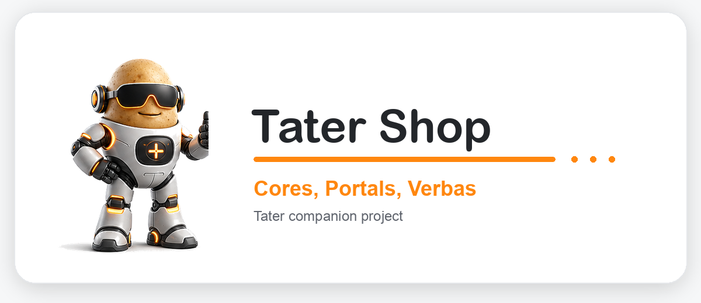

# Tater Shop

<div align="center">
  <a href="https://taterassistant.com">
    
  </a>
</div>
<h3 align="center">
  <a href="https://taterassistant.com">taterassistant.com</a>
</h3>

Tater Shop is the modular source repo for Tater verbas, portals, and cores. Tater reads the generated manifests in this repo and downloads only the selected modules into the local runtime.

The manifests are the source of the store inventory:

- `manifest.json` for verbas.
- `portal_manifest.json` for portals.
- `core_manifest.json` for cores.

The README is intentionally not an inventory table. It is the authoring guide for adding new shop packages.

## Repo Layout

- `verba/`: Hydra-callable tools, usually one user-facing skill or action per file.
- `portals/`: platform runtimes such as Discord, Matrix, IRC, HomeKit, or macOS.
- `cores/`: background services, web UI panels, Hydra kernel tools, and shared context providers.
- `tools/`: manifest generators for the three shop package types.

## Build A Verba

A verba is a tool Hydra can route to. Verbas should be narrow, predictable, and explicit about when they should be used.

Create `verba/example_lookup.py`:

```python
import logging
from typing import Any, Dict

from verba_base import ToolVerba
from verba_result import action_failure, action_success

logger = logging.getLogger("example_lookup")


class ExampleLookupPlugin(ToolVerba):
    name = "example_lookup"
    verba_name = "Example Lookup"
    pretty_name = "Example Lookup"
    version = "1.0.0"
    min_tater_version = "59"

    usage = '{"function":"example_lookup","arguments":{"query":"check the example status"}}'
    description = "Look up an example value."
    verba_dec = "Look up an example value."
    when_to_use = "Use when the user asks for the example lookup."
    how_to_use = "Pass one natural-language lookup request in query."
    common_needs = []
    missing_info_prompts = ["What should I look up?"]
    example_calls = [
        '{"function":"example_lookup","arguments":{"query":"check the example status"}}',
        '{"function":"example_lookup","arguments":{"query":"look up the current example value"}}',
    ]

    settings_category = "Example Lookup"
    platforms = ["webui", "macos", "voice_core", "discord", "telegram", "matrix", "irc", "meshtastic"]
    tags = ["example"]
    routing_keywords = ["example lookup", "example status"]

    required_settings = {
        "EXAMPLE_TIMEOUT_SECONDS": {
            "label": "Timeout Seconds",
            "type": "number",
            "default": 10,
            "description": "Timeout for example requests.",
        },
    }

    @staticmethod
    def _query(args: Dict[str, Any]) -> str:
        return str((args or {}).get("query") or (args or {}).get("request") or "").strip()

    async def _handle(self, args: Dict[str, Any], llm_client=None) -> Dict[str, Any]:
        query = self._query(args)
        if not query:
            return action_failure(
                code="missing_query",
                message="No example lookup query was provided.",
                needs=["Provide a query."],
                say_hint="Ask what the user wants to look up.",
            )

        result = {"query": query, "value": "example result"}
        return action_success(
            facts=result,
            summary_for_user=f"Example lookup returned: {result['value']}.",
            say_hint="Summarize the example lookup result.",
        )

    async def handle_webui(self, args, llm_client):
        return await self._handle(args or {}, llm_client)

    async def handle_macos(self, args, llm_client, context=None):
        return await self._handle(args or {}, llm_client)

    async def handle_voice_core(self, args=None, llm_client=None, context=None, *unused_args, **unused_kwargs):
        return await self._handle(args or {}, llm_client)

    async def handle_discord(self, message, args, llm_client):
        return await self._handle(args or {}, llm_client)

    async def handle_telegram(self, update, args, llm_client):
        return await self._handle(args or {}, llm_client)

    async def handle_matrix(self, client, room, sender, body, args, llm_client=None, **kwargs):
        return await self._handle(args or {}, llm_client)

    async def handle_irc(self, bot, channel, user, raw_message, args, llm_client):
        return await self._handle(args or {}, llm_client)

    async def handle_meshtastic(self, args=None, llm_client=None, context=None, **kwargs):
        return await self._handle(args or {}, llm_client)


verba = ExampleLookupPlugin()
```

### Verba Contract

The manifest generator reads class attributes from the first `ToolVerba` subclass:

- `name`: stable tool id. Use lowercase snake case.
- `verba_name` or `pretty_name`: display name.
- `version`: bump when behavior changes.
- `min_tater_version`: minimum supported Tater version.
- `description` and `verba_dec`: short store and routing description.
- `platforms` or `portals`: supported surfaces.
- `settings_category`: settings bucket shown in Tater.
- `required_settings`: settings fields for the UI.
- `tags`: optional store and routing tags.

Use prose for `when_to_use` and `how_to_use`. Use JSON tool-call strings for `usage` and `example_calls`, but keep the request payload natural-language: prefer one field such as `query` or `request` containing what the user asked, for example `{"function":"example_lookup","arguments":{"query":"check the example status"}}`. Hydra should learn when to route to the verba and what argument shape to pass; the verba should parse, normalize, validate, and ask for missing details inside its own handler.

Treat Hydra's AI routing pass as a router, not as the plugin's domain interpreter. If a verba needs structured intent, make a second AI interpretation call inside the verba after routing, then validate the result against settings, known entities, and API constraints. See `verba/ha_lights.py` for a full example of this pattern:

```python
usage = '{"function":"ha_lights","arguments":{"query":"turn off office lights"}}'

async def _handle(self, args, llm_client):
    query = self._coerce_text(args.get("query"))
    if not query:
        return action_failure(...)

    intent = await self._interpret_query(query, llm_client)
    if not intent:
        return action_failure(...)

    # Validate intent, resolve entities/settings, then execute the action.
```

Handlers are platform-specific. Keep one private `_handle()` method when possible and let platform handlers normalize into it. Return `action_success(...)` or `action_failure(...)` so every portal can narrate results consistently.

## Build A Portal

A portal is a runtime bridge for one platform. It receives platform events, builds an origin/context payload, calls Hydra, and sends the response back to the platform.

Create `portals/example_portal.py`:

```python
"""Example integration portal for Tater."""

import logging
import time
from typing import Any, Dict

from helpers import get_llm_client_from_env, redis_client
from hydra import run_hydra_turn

__version__ = "1.0.0"
MIN_TATER_VERSION = "59"
PORTAL_DESCRIPTION = "Example integration portal for Tater."
TAGS = ["example"]

logger = logging.getLogger("example_portal")

PORTAL_SETTINGS = {
    "category": "Example Portal Settings",
    "tags": TAGS,
    "required": {
        "poll_interval_seconds": {
            "label": "Poll Interval Seconds",
            "type": "number",
            "default": 5,
            "description": "How often the example portal polls for messages.",
        },
    },
}


def _settings() -> Dict[str, str]:
    return redis_client.hgetall("example_portal_settings") or {}


def _poll_interval() -> float:
    try:
        return max(1.0, float(_settings().get("poll_interval_seconds") or 5))
    except Exception:
        return 5.0


def run(stop_event=None) -> None:
    llm_client = get_llm_client_from_env()
    logger.info("[example_portal] started")
    try:
        while not (stop_event and stop_event.is_set()):
            # Replace this with platform polling, websocket handling, or API processing.
            time.sleep(_poll_interval())

            # Example Hydra call shape:
            # result = await run_hydra_turn(
            #     user_text="hello",
            #     llm_client=llm_client,
            #     platform="example",
            #     origin={"platform": "example", "user_id": "user", "room_id": "room"},
            # )
            # Send result text/artifacts back to the platform.
    finally:
        logger.info("[example_portal] stopped")
```

### Portal Contract

The portal manifest generator reads:

- File name: `*_portal.py`.
- `__version__` or `VERSION`.
- `MIN_TATER_VERSION`.
- `PORTAL_DESCRIPTION` or `DESCRIPTION`.
- `TAGS`.
- `PORTAL_SETTINGS`.
- `run(stop_event=None)`.

Use `PORTAL_SETTINGS["required"]` for settings fields. Keep credentials in `password` fields. Make `run()` cooperative: it must check `stop_event.is_set()` and exit cleanly.

Portals should not implement business logic that belongs in a verba or core. Their job is transport, identity/origin normalization, message history, platform-specific formatting, and delivery.

## Build A Core

A core is a background service. Cores can also expose custom Web UI tabs, Hydra kernel tools, and context/prompt fragments.

Create `cores/example_core.py`:

```python
import logging
import time
from typing import Any, Dict, List, Optional

from helpers import redis_client

__version__ = "1.0.0"
MIN_TATER_VERSION = "59"
CORE_DESCRIPTION = "Example background core for Tater."
TAGS = ["example"]

logger = logging.getLogger("example_core")

CORE_SETTINGS = {
    "category": "Example Core Settings",
    "hydra_tools_require_running": False,
    "required": {
        "poll_interval_seconds": {
            "label": "Poll Interval Seconds",
            "type": "number",
            "default": 30,
            "description": "How often Example Core refreshes data.",
        },
    },
    "tags": TAGS,
}

CORE_WEBUI_TAB = {
    "label": "Example",
    "order": 50,
    "requires_running": False,
}


def _settings(client: Any = None) -> Dict[str, Any]:
    store = client or redis_client
    return store.hgetall("example_core_settings") or {}


def _poll_interval(client: Any = None) -> float:
    try:
        return max(5.0, float(_settings(client).get("poll_interval_seconds") or 30))
    except Exception:
        return 30.0


def run(stop_event=None) -> None:
    logger.info("[example_core] started")
    try:
        while not (stop_event and stop_event.is_set()):
            redis_client.hset("example_core:status", mapping={"last_seen": str(time.time())})
            interval = _poll_interval()
            deadline = time.time() + interval
            while time.time() < deadline:
                if stop_event and stop_event.is_set():
                    break
                time.sleep(0.5)
    finally:
        logger.info("[example_core] stopped")


def get_htmlui_tab_data(*, redis_client=None, **_kwargs) -> Dict[str, Any]:
    client = redis_client or globals().get("redis_client")
    status = client.hgetall("example_core:status") or {}
    return {
        "summary": "Example Core status.",
        "stats": [
            {"label": "Last Seen", "value": status.get("last_seen") or "never"},
        ],
        "empty_message": "No example data yet.",
        "ui": {
            "kind": "settings_manager",
            "title": "Example Core",
            "manager_tabs": [
                {"key": "overview", "label": "Overview", "source": "items"},
                {"key": "create", "label": "Create", "source": "add_form"},
            ],
            "default_tab": "overview",
            "add_form": {
                "action": "example_create",
                "submit_label": "Create",
                "fields": [
                    {"key": "name", "label": "Name", "type": "text", "required": True},
                ],
            },
            "item_forms": [
                {
                    "id": "example",
                    "title": "Example Item",
                    "subtitle": "Stored by Example Core",
                    "fields": [
                        {"key": "name", "label": "Name", "type": "text", "value": "Example"},
                    ],
                    "actions": [
                        {"action": "example_save", "label": "Save"},
                        {"action": "example_delete", "label": "Delete", "danger": True},
                    ],
                }
            ],
        },
    }


def handle_htmlui_tab_action(*, action: str, payload: Dict[str, Any], redis_client=None, **_kwargs) -> Dict[str, Any]:
    client = redis_client or globals().get("redis_client")
    values = (payload or {}).get("values") if isinstance((payload or {}).get("values"), dict) else {}
    if action == "example_create":
        name = str(values.get("name") or "").strip()
        if not name:
            raise ValueError("Name is required.")
        client.hset("example_core:item", mapping={"name": name})
        return {"ok": True, "message": "Created example item."}
    raise KeyError(f"Unsupported Example Core UI action: {action}")


def get_hydra_kernel_tools(*, platform: str = "", **_kwargs) -> List[Dict[str, Any]]:
    return [
        {
            "id": "example_status",
            "description": "Read Example Core status.",
            "usage": '{"function":"example_status","arguments":{}}',
        }
    ]


async def run_hydra_kernel_tool(
    *,
    tool_id: str,
    args: Optional[Dict[str, Any]] = None,
    platform: str = "",
    scope: str = "",
    origin: Optional[Dict[str, Any]] = None,
    llm_client: Any = None,
    redis_client: Any = None,
    **_kwargs,
) -> Optional[Dict[str, Any]]:
    if tool_id != "example_status":
        return None
    client = redis_client or globals().get("redis_client")
    status = client.hgetall("example_core:status") or {}
    return {
        "tool": "example_status",
        "ok": True,
        "status": status,
        "summary_for_user": "Example Core is available.",
    }
```

### Core Contract

The core manifest generator reads:

- File name: `*_core.py`.
- `__version__` or `VERSION`.
- `MIN_TATER_VERSION`.
- `CORE_DESCRIPTION` or `DESCRIPTION`.
- `CORE_SETTINGS`.
- `CORE_WEBUI_TAB`.
- `TAGS`.
- `run(stop_event=None)`.

`CORE_SETTINGS` drives the Settings UI and runtime behavior. Set `hydra_tools_require_running` to `False` when Hydra tools are useful even if the background loop is stopped.

### Core Web UI

`CORE_WEBUI_TAB` makes a tab available in Tater's Web UI. `get_htmlui_tab_data()` returns the payload for that tab. For richer management screens, return `ui.kind = "settings_manager"`.

Common `settings_manager` keys:

- `title`: panel title.
- `stats`: top-level summary counters from the outer payload.
- `manager_tabs`: tab definitions with `key`, `label`, `source`, and optional `item_group`.
- `add_form`: create form with `action`, `submit_label`, and `fields`.
- `item_forms`: existing item cards/forms.
- `stats_refresh_button`: show a refresh button.
- `item_fields_dropdown`, `item_fields_popup`, `item_sections_in_dropdown`: controls how item fields are displayed.

Common field types:

- `text`
- `textarea`
- `number`
- `password`
- `checkbox`
- `select`
- `multiselect`
- `hidden`

UI actions call `handle_htmlui_tab_action(action=..., payload=..., redis_client=...)`. Raise `ValueError` for invalid input and `KeyError` for unsupported actions.

### Hydra Kernel Tools

Cores can add tools directly to Hydra without creating a separate verba:

- `get_hydra_kernel_tools(platform="", **kwargs)` returns tool definitions.
- `run_hydra_kernel_tool(tool_id=..., args=..., platform=..., scope=..., origin=..., llm_client=..., redis_client=...)` executes one tool.

Use kernel tools for core-owned data and workflows, such as memory lookup, event history, weather conditions, or scheduling. Return structured dictionaries with `ok`, relevant data, and `summary_for_user`.

Optional context hooks:

- `get_hydra_system_prompt_fragments(...)`: add core-owned prompt context.
- `get_hydra_memory_context_payload(...)` or similar core-specific payload helpers: expose compact context to Hydra.

Keep kernel tools narrow. They should be safe to call repeatedly and should not require a portal-specific transport.

## Manifest Generation

After editing shop files, regenerate the relevant manifest:

```bash
python3 tools/generate_manifest.py
python3 tools/generate_core_manifest.py
python3 tools/generate_portal_manifest.py
```

The GitHub workflow also regenerates these manifests on push. README generation is intentionally removed.

## Validation

Compile-check changed modules:

```bash
python3 -m py_compile verba/example_lookup.py
python3 -m py_compile portals/example_portal.py
python3 -m py_compile cores/example_core.py
```

Regenerate manifests and inspect the diff. The generated manifest entry should include the expected `id`, `name`, `version`, `description`, `entry`, and `sha256`.

## Design Rules

- Keep package ids stable and lowercase snake case.
- Bump `version` or `__version__` whenever behavior changes.
- Keep imports lightweight. Do not perform network calls or long discovery during import.
- Put provider credentials in settings or integrations, not hardcoded constants.
- Prefer shared integrations for external device APIs.
- Prefer a generic core or kernel tool when behavior should work across providers.
- Prefer a provider-specific verba when the tool is intentionally tied to one integration.
- Make `run(stop_event=None)` loops cooperative and quick to stop.
- Return structured results so portals can narrate consistently.
- Keep UI payloads compact and stable; large histories should be paged, filtered, or summarized.
